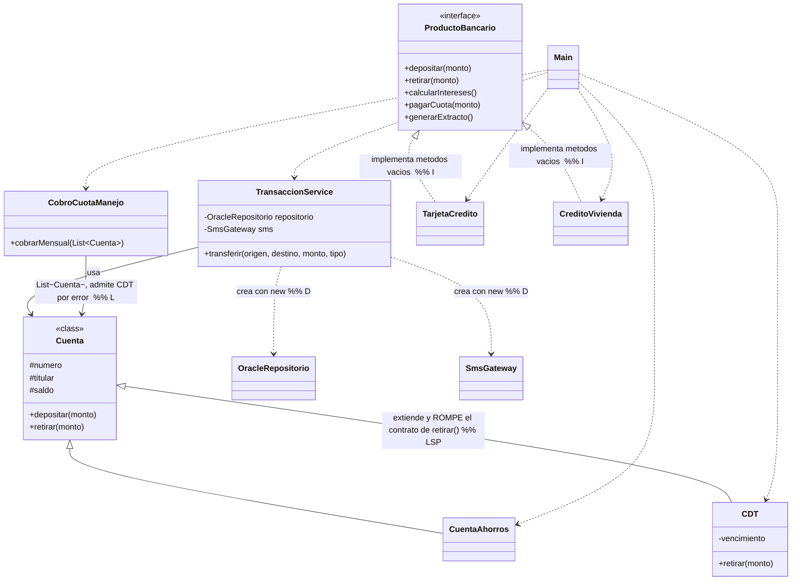
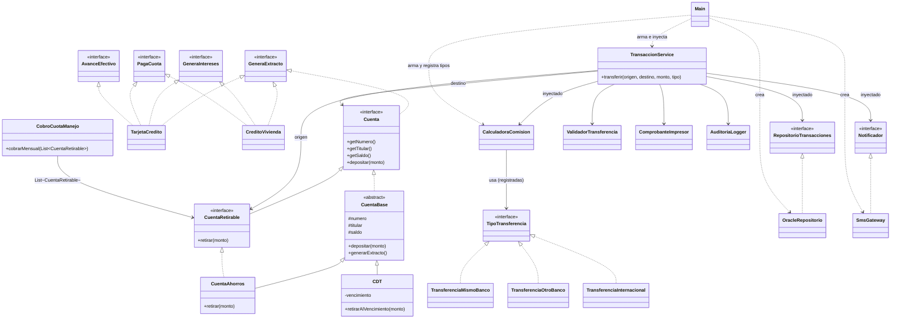

# Laboratorio L2 — Banco Andino
**Lenguaje elegido:** Java (el mismo del código base; no fue necesario traducir).

**Cómo correr el código:**
```bash
# Código original (bloque 0)
cd bloque0-original
javac *.java && java Main

# Código refactorizado (bloque 2 en adelante)
cd refactor
javac *.java && java Main

# Pruebas unitarias (bloque 3)
cd refactor
javac -d bin *.java test/*.java
java -cp bin PruebasTransaccionService
```
*(En el entorno donde preparé esta solución no había `javac` como ejecutable aparte, así que usé `java -m jdk.compiler/com.sun.tools.javac.Main` como reemplazo. En su máquina, con un JDK normal instalado, `javac` funciona directo.)*

---

## Bloque 0 — Arranque

Copié el código base tal cual, lo compilé y lo ejecuté. La salida quedó guardada en [`bloque0-original/salida_original.txt`](bloque0-original/salida_original.txt). Esta salida es la línea base: después de refactorizar, debe ser idéntica salvo la fecha/hora de auditoría.

Commit sugerido: `bloque-0-codigo-base`

---

## Bloque 1 — Diagnóstico

### 1.1 Tabla de hallazgos

| Clase / método | Letra | Evidencia en el código | Consecuencia para el banco o el cliente |
|---|---|---|---|
| `TransaccionService.transferir` | **S** | Un solo método valida el monto, calcula la comisión, mueve el dinero, guarda en Oracle, imprime el comprobante, envía el SMS y audita: 7 pasos distintos en 40 líneas. | Si el área legal pide cambiar el texto del SMS o el formato del comprobante, hay que editar y volver a probar la misma clase que mueve la plata. Un error de redacción en el mensaje puede terminar rompiendo (o requiriendo retocar) el código que calcula cuánto se cobra. |
| `TransaccionService.transferir` (switch de comisión) | **O** | `switch (tipo) { case "MISMO_BANCO" -> ...; case "OTRO_BANCO" -> ...; ... }` | Agregar un tipo de transferencia nuevo (p. ej. "EXPRESS") obliga a abrir y volver a desplegar la clase más crítica del sistema (la que mueve dinero), con el riesgo de romper un caso que ya funcionaba y que maneja plata real. |
| `CDT extends Cuenta`, override de `retirar()` | **L** | `CDT.retirar()` lanza `UnsupportedOperationException` si el CDT no ha vencido, rompiendo la promesa de `Cuenta.retirar()`. | Cualquier proceso que trate un CDT como una `Cuenta` cualquiera (como el cobro masivo de cuota de manejo) puede **explotar en producción** a mitad de un lote. Lo comprobé en el experimento 1.2.1: el proceso cobra a la primera cuenta y se cae en el CDT, dejando sin cobrar a las cuentas siguientes. |
| `ProductoBancario` (interfaz) | **I** | `TarjetaCredito.depositar()` y `CreditoVivienda.depositar()/retirar()` están vacíos ("no aplica"). | Si alguien en el equipo llama `creditoVivienda.retirar(500_000)` esperando que funcione, el banco "autoriza" silenciosamente una operación que no hizo nada: no hay excepción, no hay log, solo una llamada que no tuvo efecto. Es el tipo de bug que se detecta meses después, en una auditoría o una reclamación de un cliente. |
| `TransaccionService` (campos `repositorio` y `sms`) | **D** | `private final OracleRepositorio repositorio = new OracleRepositorio();` y lo mismo con `SmsGateway`: dependencias concretas creadas adentro. | Migrar de Oracle a otro motor obliga a tocar `TransaccionService`, aunque sus reglas de negocio no cambiaron. Y —más grave para el día a día del equipo— **es imposible probar `transferir()` sin conectarse a la base de producción y sin mandar un SMS real** cada vez que se corre una prueba. |

### 1.2 Dos experimentos

**Experimento 1 — El CDT.** Modifiqué temporalmente el programa para incluir el CDT de Ana en el cobro de cuota de manejo (`cobrarMensual(List.of(ana, cdtAna, luis))`). Esta fue la salida real:
```
Cobrando cuota de manejo a 3 cuentas, incluyendo un CDT...
Cuota de manejo cobrada a 001-1
Exception in thread "main" java.lang.UnsupportedOperationException: Un CDT no permite retiros antes del vencimiento
	at CDT.retirar(CDT.java:14)
	at CobroCuotaManejo.cobrarMensual(CobroCuotaManejo.java:8)
	at MainExperimento.main(MainExperimento.java:11)
```
A Ana (cuenta 1) sí se le cobró. El programa se cae en el CDT (cuenta 2) y **Luis (cuenta 3) nunca llega a cobrarse**. En un proceso nocturno real con un millón de cuentas, si la cuenta 500.000 fuera un CDT, las primeras 499.999 quedarían cobradas, el proceso moriría ahí, y las 500.000 restantes no se tocarían — sin ninguna transacción, sin rollback, sin que nadie se entere hasta la mañana siguiente cuando empiecen los reclamos.

**Experimento 2 — La prueba imposible.** Intenté escribir una prueba que verificara que una transferencia a otro banco cobra $7.500, sin tocar Oracle ni SMS. No se puede: `TransaccionService` crea `new OracleRepositorio()` y `new SmsGateway()` como campos privados dentro de sí misma. No hay ningún punto de entrada (constructor, setter, parámetro) para reemplazarlos por un doble de prueba. Lo único "posible" sería capturar la salida estándar (`System.out`) y buscar el texto que imprime `OracleRepositorio`, lo cual no es probar el comportamiento, es hacer parsing frágil de logs. Esto es exactamente lo que el principio D resuelve: mientras `TransaccionService` dependa de clases concretas en vez de abstracciones, no hay forma limpia de aislarla para probarla.

### 1.3 Medición "antes"

| Métrica | Antes |
|---|---|
| Líneas del método `transferir` | 35 (sin contar llaves) |
| Razones distintas por las que `TransaccionService` podría cambiar | 5 (reglas de validación, cálculo de comisión, formato del comprobante, texto/canal de notificación, formato de auditoría) |
| Clases concretas que `TransaccionService` crea con `new` | 2 (`OracleRepositorio`, `SmsGateway`) |
| Métodos vacíos o que lanzan excepción por "no aplica" | 3 (`TarjetaCredito.depositar`, `CreditoVivienda.depositar`, `CreditoVivienda.retirar`) |
| ¿Se puede probar `transferir` sin Oracle ni SMS? | **No** |

### 1.4 Diagrama de clases del código original


*(Las relaciones marcadas con comentario son las que considero problemáticas: `CDT` extendiendo `Cuenta`, `TransaccionService` creando sus dependencias con `new`, `CobroCuotaManejo` aceptando cualquier `Cuenta` incluyendo un CDT, y las dos implementaciones de `ProductoBancario` con métodos vacíos.)*

Commit sugerido: `bloque-1-diagnostico`

---

## Bloque 2 — Refactorización

Trabajé en el orden S → O → L → I → D. Después de cada cambio comparé la salida con `salida_original.txt`:

```
$ diff bloque0-original/salida_original.txt refactor/salida_nueva.txt
11c11
< [AUDITORIA] 2026-10-03T20:52:14.495891210 OTRO_BANCO 001-1 -> 001-2 $150000.0
---
> [AUDITORIA] 2026-10-03T20:54:37.795754762 OTRO_BANCO 001-1 -> 001-2 $150000.0
```
Única diferencia: la fecha/hora de auditoría. El comportamiento se conservó.

### Punto de control S
Separé `TransaccionService.transferir` en colaboradores: `ValidadorTransferencia` (reglas de validación), `ComprobanteImpresor` (presentación del comprobante) y `AuditoriaLogger` (registro de auditoría). `TransaccionService` quedó como orquestador puro.

**Pregunta de control.** `TransaccionService` ahora solo "coordina los pasos de una transferencia": no hay "y" en esa frase. Si el área legal pide cambiar el formato del comprobante, el único archivo que se toca es `ComprobanteImpresor.java`.

Commit sugerido: `control-S`

### Punto de control O
Reemplacé el `switch` por el patrón Strategy: interfaz `TipoTransferencia` con tres implementaciones (`TransferenciaMismoBanco`, `TransferenciaOtroBanco`, `TransferenciaInternacional`), registradas en `CalculadoraComision` (un mapa nombre → estrategia).

**Pregunta de control.** Si llega un tipo de transferencia nuevo, el único archivo que cambia es `Main.java` (donde se registra `calculadoraComision.registrar("NUEVO_TIPO", new TransferenciaNuevoTipo())`), además de crear el archivo nuevo de la estrategia. Ni `TransaccionService` ni `CalculadoraComision` ni las estrategias existentes se tocan.

Commit sugerido: `control-O`

### Punto de control L
Separé `Cuenta` (interfaz, solo `depositar`/consultas) de `CuentaRetirable` (interfaz, agrega `retirar`). `CuentaAhorros` implementa ambas; `CDT` solo implementa `Cuenta` y expone su propia operación, `retirarAlVencimiento(monto)`, con su propia regla. `CobroCuotaManejo.cobrarMensual` ahora exige `List<CuentaRetirable>`.

**Pregunta de control.** El error se detecta **al compilar**: intenté pasar un `CDT` a `cobrarMensual(List.of(cdt))` y el compilador lo rechazó (`incompatible types`). Esto es mejor que detectarlo en producción porque el costo de un error de compilación es cero (no llega a ejecutarse) contra el costo de una excepción a mitad de un lote nocturno de un millón de cuentas, con cobros a medias y sin rollback. Un `try/catch` que ignore el error del CDT **no resuelve el problema de diseño**: seguiría siendo posible pasar un CDT por accidente a cualquier otro método que espere una cuenta retirable, y cada vez habría que acordarse de poner el mismo parche. El problema real es que el compilador debería impedir ese caso desde el principio, no que el programa decida en tiempo de ejecución "ah, era un CDT, lo ignoro".

Commit sugerido: `control-L`

### Punto de control I
Partí `ProductoBancario` en cuatro interfaces pequeñas: `GeneraExtracto`, `GeneraIntereses`, `PagaCuota` y `AvanceEfectivo`. `TarjetaCredito` implementa las cuatro (sí da avances de efectivo); `CreditoVivienda` implementa las primeras tres (no tiene sentido un "avance" sobre un crédito de vivienda). Ninguna clase tiene ya un método vacío ni un "no aplica".

**Pregunta de control.** Sí: hice que `Cuenta` también extienda `GeneraExtracto` (ver `Cuenta.java` y `CuentaBase.generarExtracto()`), así que un mismo `List<GeneraExtracto>` puede incluir cuentas, tarjetas y créditos al mismo tiempo, cada una generando su propio extracto, sin que `GeneraExtracto` necesite saber nada sobre intereses, cuotas o retiros. Solo necesité esa interfaz de un único método para lograrlo — justamente porque es pequeña y no "arrastra" los demás métodos que cada producto no comparte con los otros.

Commit sugerido: `control-I`

### Punto de control D
`TransaccionService` ahora recibe `RepositorioTransacciones` y `Notificador` (interfaces) por el constructor. `OracleRepositorio` y `SmsGateway` las implementan. Todo el armado (`new OracleRepositorio()`, `new SmsGateway()`, registro de `CalculadoraComision`) quedó centralizado en `Main.java`.

**Pregunta de control.** `TransaccionService` ya no conoce ninguna clase concreta de infraestructura: solo conoce las interfaces `RepositorioTransacciones`, `Notificador` y la clase `CalculadoraComision` (que es lógica de negocio, no infraestructura). Quién usa Oracle o SMS lo decide `Main.java` — el "armador" del sistema —, no `TransaccionService`. Volviendo al experimento 2 del bloque 1: **sí**, ya es posible esa prueba (ver bloque 3, `test2_otroBancoCobraComisionFija`, que verifica los $7.500 de comisión usando un `RepositorioFalso` y un `NotificadorFalso`, sin tocar Oracle ni enviar un SMS).

Commit sugerido: `control-D`

---

## Bloque 3 — Pruebas unitarias

Las 5 pruebas pedidas están en [`refactor/test/PruebasTransaccionService.java`](refactor/test/PruebasTransaccionService.java), usando dobles de prueba hechos a mano (`RepositorioFalso`, `NotificadorFalso`) que implementan `RepositorioTransacciones` y `Notificador`.

> **Nota sobre el framework de pruebas.** En el entorno donde preparé esta solución no tengo acceso de red a Maven Central, así que no pude descargar JUnit. Escribí un mini-framework de aserciones a mano (`Assertions.java`: `assertEquals`, `assertTrue`, `assertThrows`) con la misma lógica que tendrían las pruebas en JUnit 5. Para pasarlo a JUnit real en su máquina: agreguen la dependencia `org.junit.jupiter:junit-jupiter`, pongan `@Test` encima de cada método `testN_...`, cambien `Assertions.assertEquals/assertTrue` por `org.junit.jupiter.api.Assertions.assertEquals/assertTrue`, y `Assertions.assertThrows(Tipo.class, () -> ...)` por `org.junit.jupiter.api.Assertions.assertThrows(Tipo.class, () -> ...)` (la sintaxis es casi idéntica a propósito). El `main` manual se reemplaza por dejar que el runner de JUnit descubra las pruebas.

Resultado real de la ejecución:
```
OK   - test1_mismoBancoSinComision
OK   - test2_otroBancoCobraComisionFija
OK   - test3_saldoInsuficienteNoGuardaNiNotifica
OK   - test4_unaSolaTransaccionUnaSolaNotificacion
OK   - test5_tipoDesconocidoNoMueveElSaldo
5/5 pruebas pasaron en 118 ms
```
Ningún `[ORACLE]` ni `[SMS]` aparece en esa salida (solo el comprobante y la auditoría, que son impresiones deterministas sin efectos externos): ninguna prueba tocó infraestructura real.

**Pregunta de control.** Las 5 pruebas tardan 118 ms en total. Para poder probar `TransaccionService` no tuve que cambiarle ninguna línea de lógica de negocio — el cambio que lo hizo posible fue el del punto de control D (recibir las dependencias por constructor), hecho en el bloque 2. En el bloque 1, estas mismas pruebas eran imposibles de escribir sin tocar Oracle y SMS de verdad (ver experimento 2): cada corrida habría intentado conectarse a una base de datos de producción simulada y "enviar" un SMS, y no habría forma de interceptar ni verificar esas llamadas desde la prueba.

Commit sugerido: `bloque-3-pruebas`

---

## Bloque 4 — "Negocio pidió cambios"

**No pude completar este bloque.** Los cinco requerimientos los entrega el docente en clase (la guía dice explícitamente: *"Al iniciar este bloque, el docente les entregará una hoja con cinco requerimientos nuevos"*), y no los tengo. Dejo la tabla lista para completar:

| Req. | Archivos a modificar en el código original (estimado) | Archivos existentes modificados (real) | Archivos nuevos | ¿Se rompió alguna prueba? |
|---|---|---|---|---|
| R1 | | | | |
| R2 | | | | |
| R3 | | | | |
| R4 | | | | |
| R5 | | | | |

Cuando tengan los requerimientos, el flujo que ya dejé listo ayuda bastante: para un tipo de transferencia nuevo, solo hay que crear una clase `TipoTransferencia` y registrarla en `Main`; para un producto bancario nuevo, solo hay que decidir cuáles de las interfaces pequeñas (`GeneraExtracto`, `GeneraIntereses`, `PagaCuota`, `AvanceEfectivo`) le aplican; para una fuente de persistencia o notificación nueva, solo hay que implementar `RepositorioTransacciones` o `Notificador` y cambiar una línea en `Main`.

Commit sugerido: uno por requerimiento (`req-1` … `req-5`)

---

## Bloque 5 — Revisión cruzada

**Tampoco pude completar este bloque**: requiere intercambiar el repositorio con una pareja real de su curso y que el docente entregue un requerimiento nuevo para implementar sobre código ajeno. Dejo la lista de revisión en blanco, lista para usar:

| Lista de revisión | Sí | No |
|---|---|---|
| Entendimos qué hace cada clase leyendo solo su nombre y sus métodos públicos. | | |
| Pudimos reutilizar piezas existentes sin copiar y pegar código. | | |
| Implementamos el requerimiento sin modificar la lógica de clases existentes. | | |
| No encontramos métodos vacíos ni que lancen "no aplica". | | |
| No encontramos if/switch por tipo que tuvimos que extender. | | |
| Las pruebas existentes siguieron pasando después de nuestro cambio. | | |
| No encontramos abstracciones innecesarias (interfaces que no aportan). | | |

Commit sugerido (en el repositorio de la otra pareja, en una rama): `revision-cruzada`

---

## Bloque 6 — Cierre

### Diagrama de clases del código final



### Tabla comparativa

| Métrica | Antes | Después |
|---|---|---|
| Líneas del método `transferir` | 35 | 8 |
| Razones distintas por las que `TransaccionService` podría cambiar | 5 | 1 (cambios en el orden/los pasos de la orquestación de una transferencia) |
| Clases concretas que `TransaccionService` crea con `new` | 2 (`OracleRepositorio`, `SmsGateway`) | 0 (recibe `RepositorioTransacciones` y `Notificador` por constructor) |
| Métodos vacíos o que lanzan "no aplica" | 3 | 0 |
| ¿Se puede probar `transferir` sin Oracle ni SMS? | No | Sí (5/5 pruebas, 118 ms) |
| Número total de archivos | 11 | 30 (26 de producción, incluyendo `Main`, + 4 de pruebas: el runner, las aserciones y los dos dobles de prueba) |
| Archivos existentes modificados en total en el bloque 4 | — | *(pendiente: depende de los requerimientos reales del bloque 4)* |

### Reflexión

**(a) El código final tiene muchos más archivos que el original. ¿Es eso un problema?**
No en sí mismo: cada archivo nuevo tiene una responsabilidad clara y un nombre que la describe (`AuditoriaLogger`, `TransferenciaInternacional`, `RepositorioFalso`...), así que encontrar dónde vive cada comportamiento es más rápido, no más lento. Sí sería un problema si la fragmentación no reflejara responsabilidades reales — por ejemplo, si hubiera partido una clase en tres archivos solo para que cada uno tuviera menos líneas, sin que cada uno represente una razón de cambio distinta. Eso sería sobreingeniería: más indirección sin beneficio real.

**(b)–(d)** Estas preguntas dependen de datos que todavía no existen en esta entrega (los requerimientos del bloque 4 y la retroalimentación de la revisión cruzada del bloque 5). Quedan para completar cuando el docente las entregue.

**(e) Si tuvieran que convencer a su jefe de invertir dos semanas en refactorizar el backend real del banco, ¿qué argumento usarían?**
Con los datos de hoy: el método central del sistema bajó de 35 a 8 líneas sin cambiar lo que hace (la salida es idéntica, verificada con `diff`); un error de diseño que antes solo se veía **en producción, a mitad de un lote nocturno** (el experimento del CDT) ahora el compilador lo rechaza antes de desplegar nada; y un conjunto de pruebas que antes era **imposible de escribir** sin tocar la base de datos de producción y mandar SMS reales ahora corre completo en 118 milisegundos. Eso significa menos incidentes en producción, menos tiempo de desarrollador gastado en pruebas manuales repetidas, y la posibilidad real de agregar un tipo de transferencia o un producto nuevo sin arriesgar el código que ya funciona.

Commit sugerido: `bloque-6-cierre`
