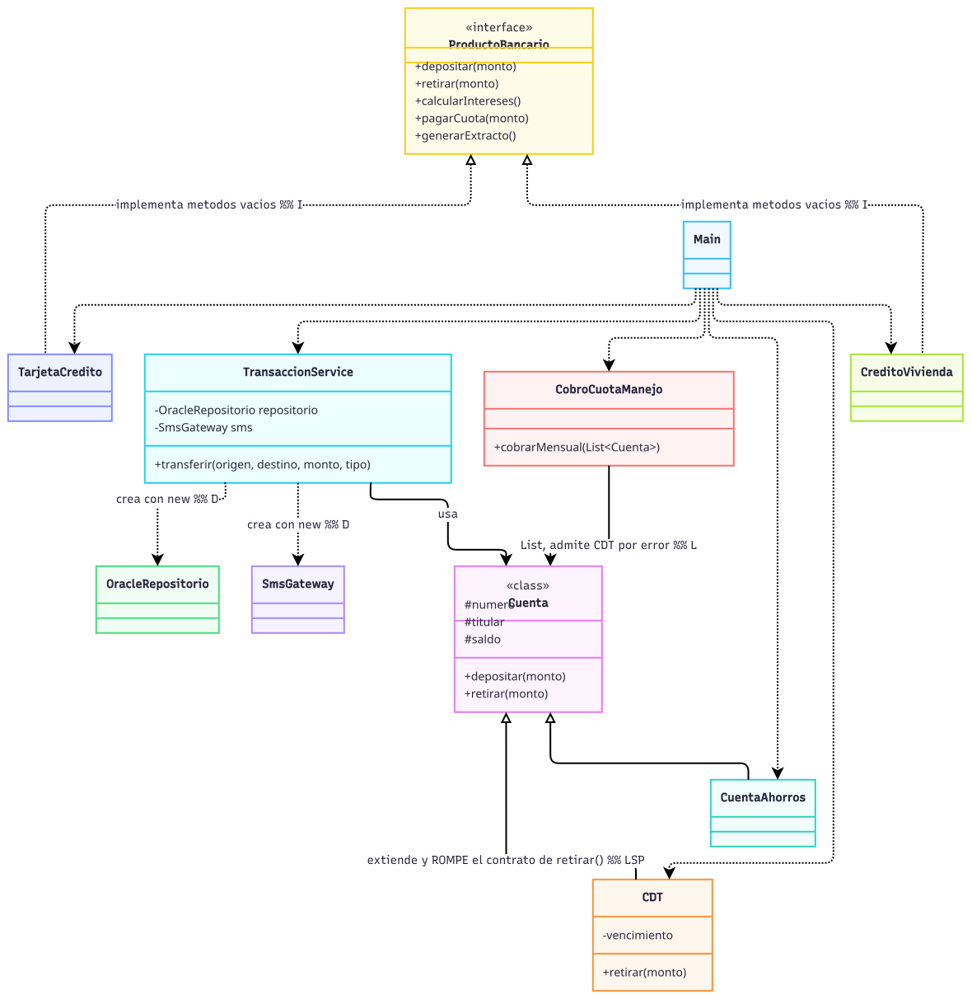

# Laboratorio L2 — Banco Andino
**Lenguaje elegido:** Java (el mismo del código base; no fue necesario traducir).

---

## Bloque 0 — Arranque

Se copió el código base tal cual, se compiló y ejecutó. La salida quedó guardada en [`bloque0-original/salida_original.txt`](bloque0-original/salida_original.txt).

Commit: `bloque-0-codigo-base`

---

## Bloque 1 — Diagnóstico

### 1.1 Tabla de hallazgos

| Clase / método | Letra | Evidencia en el código | Consecuencia para el banco o el cliente |
|---|---|---|---|
| `TransaccionService.transferir` | **S** | Un solo método valida el monto, calcula la comisión, mueve el dinero, guarda en Oracle, imprime el comprobante, envía el SMS y audita: 7 pasos distintos en 40 líneas. | Si el área legal pide cambiar el texto del SMS o el formato del comprobante, hay que editar y volver a probar la misma clase que mueve la plata. Un error de redacción en el mensaje puede terminar rompiendo (o requiriendo retocar) el código que calcula cuánto se cobra. |
| `TransaccionService.transferir` (switch de comisión) | **O** | `switch (tipo) { case "MISMO_BANCO" -> ...; case "OTRO_BANCO" -> ...; ... }` | Agregar un tipo de transferencia nuevo (p. ej. "EXPRESS") obliga a abrir y volver a desplegar la clase más crítica del sistema (la que mueve dinero), con el riesgo de romper un caso que ya funcionaba y que maneja plata real. |
| `CDT extends Cuenta`, override de `retirar()` | **L** | `CDT.retirar()` lanza `UnsupportedOperationException` si el CDT no ha vencido, rompiendo la promesa de `Cuenta.retirar()`. | Cualquier proceso que trate un CDT como una `Cuenta` cualquiera (como el cobro masivo de cuota de manejo) puede **explotar en producción** a mitad de un lote. Se evidencia en el experimento 1.2.1: el proceso cobra a la primera cuenta y se cae en el CDT, dejando sin cobrar a las cuentas siguientes. |
| `ProductoBancario` (interfaz) | **I** | `TarjetaCredito.depositar()` y `CreditoVivienda.depositar()/retirar()` están vacíos ("no aplica"). | Si alguien en el equipo llama `creditoVivienda.retirar(500_000)` esperando que funcione, el banco "autoriza" silenciosamente una operación que no hizo nada: no hay excepción, no hay log, solo una llamada que no tuvo efecto. Es el tipo de bug que se detecta meses después, en una auditoría o una reclamación de un cliente. |
| `TransaccionService` (campos `repositorio` y `sms`) | **D** | `private final OracleRepositorio repositorio = new OracleRepositorio();` y lo mismo con `SmsGateway`: dependencias concretas creadas adentro. | Migrar de Oracle a otro motor obliga a tocar `TransaccionService`, aunque sus reglas de negocio no cambiaron. Y —más grave para el día a día del equipo— **es imposible probar `transferir()` sin conectarse a la base de producción y sin mandar un SMS real** cada vez que se corre una prueba. |

### 1.2 Dos experimentos

**Experimento 1 — El CDT.** Se añadió temporalmente el programa para incluir el CDT de Ana en el cobro de cuota de manejo (`cobrarMensual(List.of(ana, cdtAna, luis))`). Esta fue la salida:
```
Cobrando cuota de manejo a 3 cuentas, incluyendo un CDT...
Cuota de manejo cobrada a 001-1
Exception in thread "main" java.lang.UnsupportedOperationException: Un CDT no permite retiros antes del vencimiento
	at CDT.retirar(CDT.java:14)
	at CobroCuotaManejo.cobrarMensual(CobroCuotaManejo.java:8)
	at MainExperimento.main(MainExperimento.java:11)
```
A Ana (cuenta 1) sí se le cobró. El programa se cae en el CDT (cuenta 2) y Luis (cuenta 3) nunca llega a cobrarse. En un proceso nocturno real con un millón de cuentas, si la cuenta 500.000 fuera un CDT, las primeras 499.999 quedarían cobradas, el proceso moriría ahí, y las 500.000 restantes no se tocarían — sin ninguna transacción, sin rollback, sin que nadie se entere hasta la mañana siguiente cuando empiecen los reclamos.

**Experimento 2** Se intentó escribir una prueba que verificara que una transferencia a otro banco cobra $7.500, sin tocar Oracle ni SMS. No se puede: `TransaccionService` crea `new OracleRepositorio()` y `new SmsGateway()` como campos privados dentro de sí misma. No hay ningún punto de entrada (constructor, setter, parámetro) para reemplazarlos por un doble de prueba. Lo único "posible" sería capturar la salida estándar (`System.out`) y buscar el texto que imprime `OracleRepositorio`, lo cual no es probar el comportamiento, es hacer parsing frágil de logs. Esto es exactamente lo que el principio D resuelve: mientras `TransaccionService` dependa de clases concretas en vez de abstracciones, no hay forma limpia de aislarla para probarla.

### 1.3 Medición "antes"

| Métrica | Antes |
|---|---|
| Líneas del método `transferir` | 35 (sin contar llaves) |
| Razones distintas por las que `TransaccionService` podría cambiar | 5 (reglas de validación, cálculo de comisión, formato del comprobante, texto/canal de notificación, formato de auditoría) |
| Clases concretas que `TransaccionService` crea con `new` | 2 (`OracleRepositorio`, `SmsGateway`) |
| Métodos vacíos o que lanzan excepción por "no aplica" | 3 (`TarjetaCredito.depositar`, `CreditoVivienda.depositar`, `CreditoVivienda.retirar`) |
| ¿Se puede probar `transferir` sin Oracle ni SMS? | **No** |

### 1.4 Diagrama de clases del código original



---
Commit: `bloque-1-diagnostico`

---
## Bloque 2 — Refactorización

### Punto de control S
Se separó `TransaccionService.transferir` en colaboradores: `ValidadorTransferencia` (reglas de validación), `ComprobanteImpresor` (presentación del comprobante) y `AuditoriaLogger` (registro de auditoría). `TransaccionService` quedó como orquestador puro.

**Pregunta de control.** `TransaccionService` ahora solo "coordina los pasos de una transferencia": no hay "y" en esa frase. Si el área legal pide cambiar el formato del comprobante, el único archivo que se toca es `ComprobanteImpresor.java`.

Commit: `control-S`

